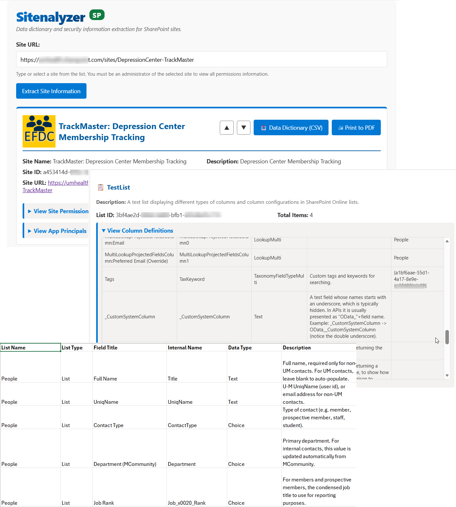

<!--
This file is part of Sitenalyzer
README.md - Main README file with overview, quick start guide and license information.
Author(s): Gabriel Mongefranco
Created: 2026-04-20
Last Modified: 2026-04-30
Summary: Provides an overview of the project, in Markdown format.
Notes: See README file for documentation and full license information.

Copyright © 2026 The Regents of the University of Michigan

This program is free software: you can redistribute it and/or modify
it under the terms of the GNU General Public License as published by
the Free Software Foundation, either version 3 of the License, or (at your option) any later version.
This program is distributed in the hope that it will be useful,
but WITHOUT ANY WARRANTY; without even the implied warranty of
MERCHANTABILITY or FITNESS FOR A PARTICULAR PURPOSE. See the
GNU General Public License for more details.
You should have received a copy of the GNU General Public License along
with this program. If not, see <https://www.gnu.org/licenses/>.

-->

# Sitenalyzer

## Description
Sitenalyzer helps you extract a data dictionary and security information from your SharePoint sites. Data dictionary functionality allows you to query other sites, edit list and column descriptions if you have admin rights to that site, and export the data dictionary as a spreadsheet.

Sitenalyzer is a single-file HTML/JavaScript application designed to be embedded into a SharePoint Online site via a Modern Script Editor Webpart. It can be used to gather information to audit permissions, to get the internal IDs necessary for creating Applications (for MS Graph API access) in MS Entra, or to document the data structure of lists and document libraries. 

## Quick Start Guide
+ First ensure you have the "Modern Script Editor" app installed. If not available, contact your site administrator to install it
+ Go to your site's home page and create a new page using the Modern Script Editor template. Use "Sitenalyzer" for the page title.
+ In the "Modern Script Editor" webpart, click "Markup" then click the "{ }" button to open the code editor.
+ Copy and the paste the code from [Sitenalyzer.html](Sitenalyzer.html) into the script editor.
  - Note: If your SharePoint tenant has CSP restrictions that block inline JavaScript, you may need to separate the contents of the JavaScript file into its own .js file and store it in your site's Site Assets library. Then, update the script tag near the bottom of the file to point to htttp://you-tenant.sharepoint.com/sites/your-site/SiteAssets/Sitenalyzer.js.
+ Save, and refresh the page.

## Documentation
+ The full documentation is available at: https://michmed.org/efdc-kb

## Additional Resources
+ This script was created to facilitate the process for creating Microsoft Entra applications at Michigan Medicine. For more information, see "[How to Connect to SharePoint from Scripts, Workflows or Data Pipelines](https://teamdynamix.umich.edu/TDClient/210/DepressionCenter/KB/ArticleDet?ID=15245)" (UM login required).

## About the Team
The [Mobile Technologies Core](https://depressioncenter.org/mobiletech) provides investigators across the University of Michigan the support and guidance needed to utilize mobile technologies and digital mental health measures in their studies. Experienced faculty and staff offer hands-on consultative services to researchers throughout the University – regardless of specialty or research focus.

Learn more at: [https://depressioncenter.org/mobiletech](https://depressioncenter.org/mobiletech).

## Contact
To get in touch, contact the individual developers in the check-in history.

If you need assistance identifying a contact person, email the EFDC's Mobile Technologies Core at: efdc-mobiletech@umich.edu.

## Credits
#### Contributors:
+ [Eisenberg Family Depression Center](https://depressioncenter.org) [(@DepressionCenter)](https://github.com/DepressionCenter)
+ [Gabriel Mongefranco](https://gabriel.mongefranco.com) [(@gabrielmongefranco)](https://github.com/gabrielmongefranco)
+ [Jeremy Glskin](https://www.linkedin.com/in/jeremy-gluskin-16980623/) ([@jerm-ops](https://github.com/jerm-ops))

#### This work is based in part on the following projects, libraries and/or studies:
+ [DataLaVista™](https://michmed.org/datalavista). A lightweight, client-side reporting and dashboard toolkit. This project re-uses some of the SharePoint connection functions.
+ [Modern Script Editor](https://github.com/pnp/sp-dev-fx-webparts/tree/main/samples/react-script-editor) - The PnP/SPFX delivery vehicle used to deploy this "Unit" into modern SharePoint environments.
+ [Microsoft SharePoint REST API](https://learn.microsoft.com/en-us/sharepoint/dev/sp-add-ins/get-to-know-the-sharepoint-rest-service) - The primary data uplink for retrieving SharePoint List items and Document Library metadata.
+ [SheetJS](https://sheetjs.com/) - A library for reading, processing, and writing spreadsheet data.
+ [Tabulator](https://tabulator.info/) - A library for creating interactive, data-rich tables and grids.

## License
### Copyright Notice
Copyright © 2026 The Regents of the University of Michigan

### Software and Library License Notice
This program is free software: you can redistribute it and/or modify it under the terms of the GNU General Public License as published by the Free Software Foundation, either version 3 of the License, or (at your option) any later version.

This program is distributed in the hope that it will be useful, but WITHOUT ANY WARRANTY; without even the implied warranty of MERCHANTABILITY or FITNESS FOR A PARTICULAR PURPOSE. See the GNU General Public License for more details.

You should have received a copy of the GNU General Public License along with this program. If not, see <https://www.gnu.org/licenses/gpl-3.0-standalone.html>.

### Documentation License Notice
Permission is granted to copy, distribute and/or modify this document 
under the terms of the GNU Free Documentation License, Version 1.3 
or any later version published by the Free Software Foundation; 
with no Invariant Sections, no Front-Cover Texts, and no Back-Cover Texts. 
You should have received a copy of the license included in the section entitled "GNU 
Free Documentation License". If not, see <https://www.gnu.org/licenses/fdl-1.3-standalone.html>

## Citation
If you find this repository, code or paper useful for your research, please cite it.

#### Citation Example:
>_Mongefranco, Gabriel (2026). Sitenalyzer. University of Michigan. Software. https://github.com/DepressionCenter/Sitenalyzer_  

----

Copyright © 2026 The Regents of the University of Michigan
